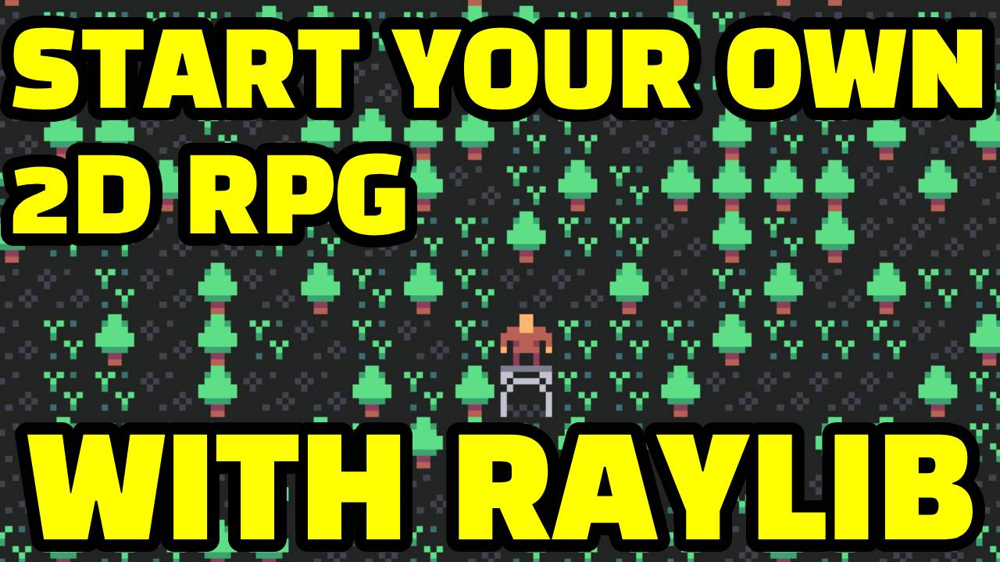

# RAYLIB 2D RPG TUTORIAL

VIEW ON YOUTUBE - https://youtu.be/vjU62r-M1CY

🎮 Dive into the exciting world of game development with this step-by-step tutorial on creating your own 2D RPG using Raylib!
Whether you're a seasoned developer or just starting out, this comprehensive guide will walk you through the process of bringing
your imagination to life.

In this video, we'll cover:
- Building a 2D grid of a "game world"
- Creating a 2D Camera targeting the Player
- Moving the Player by responding to the Keyboard
- Zoom the Camera in/out with the Mouse Wheel
- Creating a 2D grid of a "dungeon"
- Adding Entities to interact with in your 2d world
- Rogue Combat

🚀 Ready to embark on your game development journey? Hit play now and let's bring your 2D RPG to life together!

🔗Links & References
- Raylib website: https://www.raylib.com/
- Raylib github: https://github.com/raysan5/raylib
- Raylib API Cheatsheet: https://www.raylib.com/cheatsheet/cheatsheet.html
- 7DRL 2024 Gamejam: https://itch.io/jam/7drl-challenge-2024
- Micro-Roguelike Assets: https://www.kenney.nl/assets/micro-roguelike
- Soundtracks: https://alkakrab.itch.io/fantasy-rpg-soundtrack-music
- Ultima IV Controls: https://strategywiki.org/wiki/Ultima_IV:_Quest_of_the_Avatar/Controls

👋🏻Connect with me
Twitter: https://www.twitter.com/eyuzwa

# LICENSE

Copyright 2024 Erik Yuzwa

Permission is hereby granted, free of charge, to any person obtaining a copy of this software and
associated documentation files (the “Software”), to deal in the Software without restriction, including
without limitation the rights to use, copy, modify, merge, publish, distribute, sublicense, and/or sell
copies of the Software, and to permit persons to whom the Software is furnished to do so, subject to the
following conditions:

The above copyright notice and this permission notice shall be included in all copies or substantial
portions of the Software.

THE SOFTWARE IS PROVIDED “AS IS”, WITHOUT WARRANTY OF ANY KIND, EXPRESS OR IMPLIED, INCLUDING BUT NOT
LIMITED TO THE WARRANTIES OF MERCHANTABILITY, FITNESS FOR A PARTICULAR PURPOSE AND NONINFRINGEMENT. IN NO
EVENT SHALL THE AUTHORS OR COPYRIGHT HOLDERS BE LIABLE FOR ANY CLAIM, DAMAGES OR OTHER LIABILITY, WHETHER
IN AN ACTION OF CONTRACT, TORT OR OTHERWISE, ARISING FROM, OUT OF OR IN CONNECTION WITH THE SOFTWARE OR THE
USE OR OTHER DEALINGS IN THE SOFTWARE.
